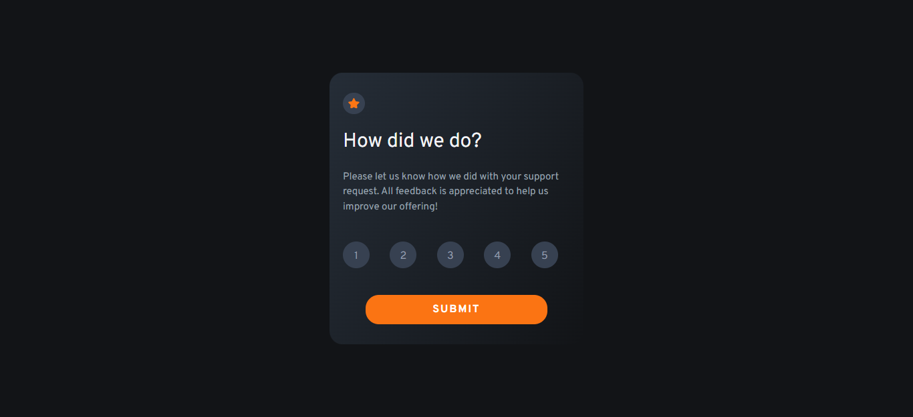

# Frontend Mentor - Interactive rating component solution

This is a solution to the [Interactive rating component challenge on Frontend Mentor](https://www.frontendmentor.io/challenges/interactive-rating-component-koxpeBUmI). Frontend Mentor challenges help you improve your coding skills by building realistic projects. 

## Overview

### The challenge

Users should be able to:

- View the optimal layout for the app depending on their device's screen size
- See hover states for all interactive elements on the page
- Select and submit a number rating
- See the "Thank you" card state after submitting a rating

### Screenshot

### Links

- Solution URL: [Github](https://github.com/danielmedtar/rating-component)
- Live Site URL: [Netlify](https://reactjs-rating-compontent.netlify.app/)

## My process

### Built with

- [React](https://reactjs.org/) - JS library
- [Tailwind CSS](https://tailwindcss.com/) - CSS framework

### What I learned

It was a great way to practice knowledge of React and to use Tailwind CSS for the first time
To see how you can add code snippets, see below:

### Continued development

I want to continue improving my skills in React.

## Author

- Website - [Daniel Medina](https://danielmedinatariba.com/)
- Frontend Mentor - [@danielmedtar](https://www.frontendmentor.io/profile/danielmedtar)
